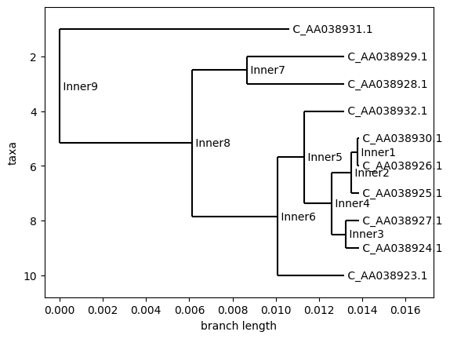

# ds596-project

DS596 final project 

Monkeypox virus

## data
This folder includes 10 partial genomes of the monkeypox virus from China in 2023 as C_AA*.fasta, as well as 2 complete genomes of the monkeypox virus from USAS in 2022 as NC_063383.1.fasta and ON563414.3.fasta 

## notebook
This folder includes 3 python notebooks. 

data.ipynb is for EDA data exploration. It shows that all fasta files have different length and different concentration of ACTG. 

tree.ipynb is to construct trees using Neighbor Joining and UPGMA. 

snp.ipynb is for SNP extraction and explore the positions of various mutations. 

## tree
This folder has the intermediate results from the tree construction as xml files

## result
This folder has 3 png image files as the main result of this project 

### nj_tree.png

nj_tree.png is the Neighbor Joining tree

### upgma_tree.png

upgma_tree.pgn is the UPGMA tree

### table.png

table.png is the result of SNP extraction and the position of mutations

### table_GA_AA.png

table_GA_AA.png is to focus on APOBEC3-like mutations GA>AA

### table_TC_TT.png

table_TC_TT.png is to focus on APOBEC3-like mutations TC>TT
